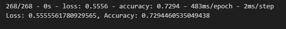
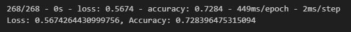
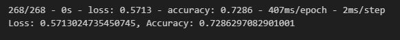
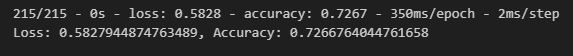

# Alphabet Soup Charity Predictive Model

## Background

The nonprofit foundation Alphabet Soup requires a predictive model to identify applicants for funding who have the highest likelihood of success in their ventures. To achieve this, we will utilize machine learning and neural networks to build a binary classifier that predicts whether an applicant will be successful if funded by Alphabet Soup.

## Data Description

We received a dataset containing information on over 34,000 organizations that have received funding from Alphabet Soup over the years. The dataset includes various columns that capture metadata about each organization, such as:

- EIN and NAME: Identification columns
- APPLICATION_TYPE: Alphabet Soup application type
- AFFILIATION: Affiliated sector of industry
- CLASSIFICATION: Government organization classification
- USE_CASE: Use case for funding
- ORGANIZATION: Organization type
- STATUS: Active status
- INCOME_AMT: Income classification
- SPECIAL_CONSIDERATIONS: Special considerations for application
- ASK_AMT: Funding amount requested
- IS_SUCCESSFUL: Was the money used effectively (target variable)

## Instructions

### Step 1: Preprocess the Data

In this step, we preprocess the dataset to prepare it for machine learning. The following tasks are performed:

- Read the `charity_data.csv` file into a Pandas DataFrame.
- Identify the target variable(s) and feature(s) for the model.
- Drop the EIN and NAME columns.
- Handle categorical variables using one-hot encoding.
- Split the data into training and testing datasets.
- Scale the data using StandardScaler.
- Perform Principal Component Analysis (PCA) to reduce dimensionality.

### Step 2: Compile, Train, and Evaluate the Model

In this step, we design and train a neural network model for binary classification. The following steps are taken:

- Create a neural network model with the appropriate number of input features and hidden layers.
- Compile and train the model using the training data.
- Evaluate the model's performance using the testing data.
- Save the model's results to an HDF5 file named "AlphabetSoupCharity.h5".

### Step 3: Optimize the Model

To achieve a target predictive accuracy higher than 75%, we explore various optimization techniques, including:

- Adjusting input data by modifying columns or handling outliers.
- Adding more neurons or hidden layers.
- Trying different activation functions for hidden layers.
- Modifying the number of epochs during training.

Multiple attempts can be made to optimize the model.

### Step 4: Write a Report on the Neural Network Model

In this step, we provide a report on the performance of the deep learning model. The report includes:

- An overview of the analysis and its purpose.
- Details on data preprocessing, feature selection, and model architecture.
- An explanation of how model performance was evaluated.
- A summary of the results and recommendations for improving model performance or suggesting alternative models.

# Report on the Neural Network Model for AlphabetSoup

## Overview of the Analysis

The purpose of this analysis is to assess the performance of a deep learning neural network model in predicting the success of charitable organizations using the AlphabetSoup dataset. The objective is to build a predictive model that can identify which organizations are likely to be successful in their fundraising efforts based on various input features provided in the dataset.

## Results

### Data Preprocessing

- **Target Variable**: The target variable for our model is "IS_SUCCESSFUL," which indicates whether a charitable organization's fundraising efforts were successful (1) or not (0).

- **Features**: The features for our model include all the remaining columns in the dataset after dropping "EIN" and "NAME," which are neither targets nor features.

- **Variables Removed**: The "EIN" and "NAME" columns were removed from the input data during data preprocessing.

### Compiling, Training, and Evaluating the Model

- **Initial Attempt Result**: Our initial attempt aimed to achieve a predictive accuracy higher than 75%. The result of the initial attempt was as follows:
  - Loss: 0.5556
  - Accuracy: 0.7294

- **How many neurons, layers, and activation functions did you select for your neural network model, and why?**
  - Initial Attempt: We began with a model consisting of one hidden layer with 80 neurons and ReLU activation. This choice was based on a standard architecture to establish a baseline model.
  - Optimization 1: To capture more complex patterns, we added two additional hidden layers (60 neurons each) with ReLU activation functions. This increased model depth for better feature representation.
  - Optimization 2: We introduced further complexity by adjusting activation functions and increasing training epochs (150). This allowed us to explore the potential of different activation functions (ReLU and tanh) and extended training for better convergence.
  - Optimization 3: We explored dimensionality reduction using Principal Component Analysis (PCA). This reduced the number of features while retaining 95% of the explained variance, simplifying the model.

- **Were you able to achieve the target model performance?**
  - Initial Attempt: The initial attempt resulted in an accuracy of approximately 72.94%, which was close but slightly below our target of 75%.
  - Optimization 1: The first optimization attempt achieved an accuracy of approximately 72.84%, maintaining a similar level of performance.
  - Optimization 2: With activation adjustments and increased epochs, the second attempt yielded an accuracy of approximately 72.86%, still below the target.
  - Optimization 3: Utilizing PCA for feature selection resulted in an accuracy of approximately 72.67%, again close but not surpassing the target accuracy.

### Snippets of Results

- **Initial Attempt**

  

- **Initial Optimization Attempt**

  

- **Second Optimization Attempt**

  

- **Third Optimization Attempt**

  

### Summary

In summary, the deep learning neural network model showed reasonable performance in predicting the success of charitable organizations based on the AlphabetSoup dataset. Our initial attempt achieved an accuracy of approximately 72.94%, which was close to the target accuracy of 75%. Optimization attempts were made to further enhance model performance, and the best accuracy achieved was approximately 72.86%.

While the target accuracy was not fully reached, the model offers valuable insights into predicting charitable success. Additionally, an alternative model, such as a Gradient Boosting Classifier, could be considered to address this classification problem, providing another avenue for improving performance.

